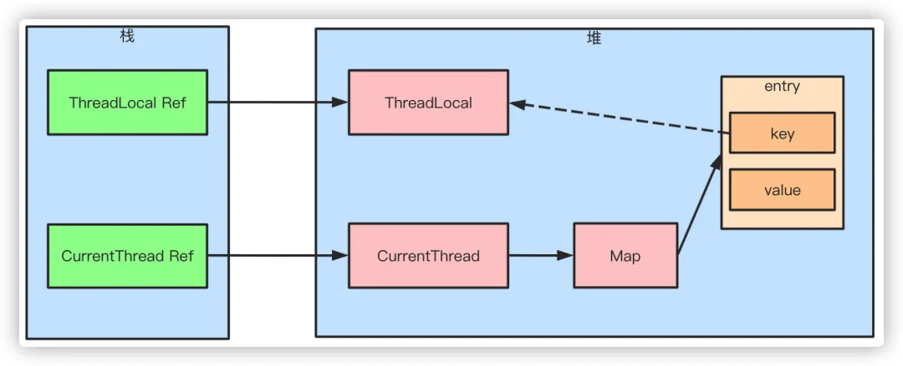
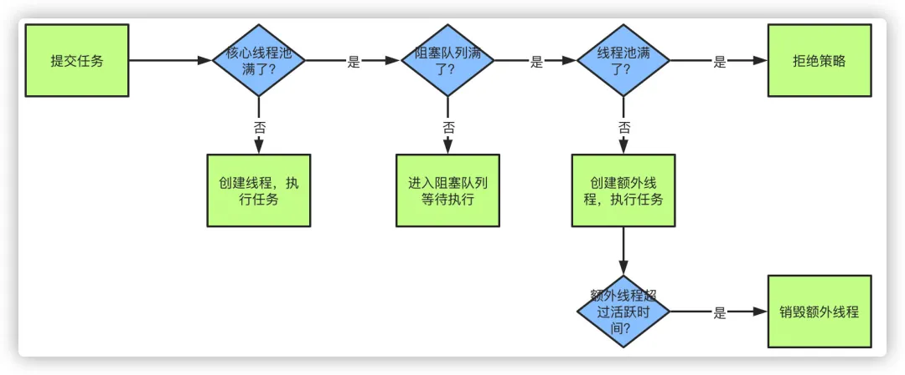
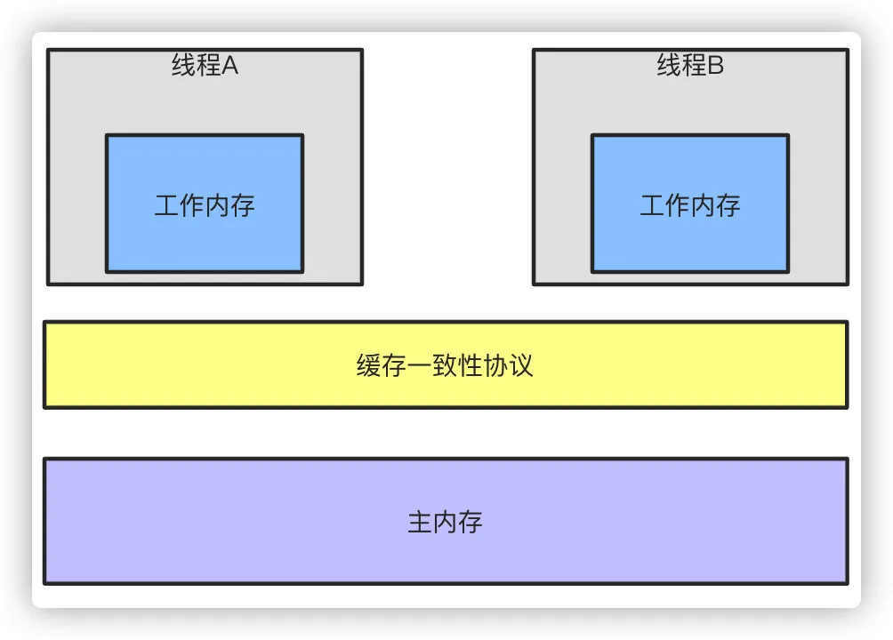

# 003.多线程&并发篇003

## 31、CAS的原理呢？

CAS叫做CompareAndSwap，比较并交换，主要是通过处理器的指令来保证操作的原子性，它包含三个操作数：

1.   变量内存地址，V表示

2.   旧的预期值，A表示

3.   准备设置的新值，B表示

当执行CAS指令时，只有当V等于A时，才会用B去更新V的值，否则就不会执行更新操作。

## 32、CAS有什么缺点吗？

CAS的缺点主要有3点：

**ABA问题**：ABA的问题指的是在CAS更新的过程中，当读取到的值是A，然后准备赋值的时候仍然是 A，但是实际上有可能A的值被改成了B，然后又被改回了A，这个CAS更新的漏洞就叫做ABA。只是 ABA的问题大部分场景下都不影响并发的最终效果。

Java中有AtomicStampedReference来解决这个问题，他加入了预期标志和更新后标志两个字段，更新时不光检查值，还要检查当前的标志是否等于预期标志，全部相等的话才会更新。

**循环时间长开销大**：自旋CAS的方式如果长时间不成功，会给CPU带来很大的开销。

**只能保证一个共享变量的原子操作**：只对一个共享变量操作可以保证原子性，但是多个则不行，多个可以通过AtomicReference来处理或者使用锁synchronized实现。

## 33、引用类型有哪些？有什么区别？

引用类型主要分为强软弱虚四种：

1.   强引用指的就是代码中普遍存在的赋值方式，比如A a = new A()这种。强引用关联的对象，永远不会被GC回收。

2.   软引用可以用SoftReference来描述，指的是那些有用但是不是必须要的对象。系统在发生内存溢出前会对这类引用的对象进行回收。

3.   弱引用可以用WeakReference来描述，他的强度比软引用更低一点，弱引用的对象下一次GC的时候一定会被回收，而不管内存是否足够。

4.   虚引用也被称作幻影引用，是最弱的引用关系，可以用PhantomReference来描述，他必须和 ReferenceQueue一起使用，同样的当发生GC的时候，虚引用也会被回收。可以用虚引用来管理堆外内存。

## 34、说说ThreadLocal原理？

hreadLocal可以理解为线程本地变量，他会在每个线程都创建一个副本，那么在线程之间访问内部副本变量就行了，做到了线程之间互相隔离，相比于synchronized的做法是用空间来换时间。

ThreadLocal有一个静态内部类ThreadLocalMap，ThreadLocalMap又包含了一个Entry数组， Entry本身是一个弱引用，他的key是指向ThreadLocal的弱引用，Entry具备了保存key value键值对的能力。

弱引用的目的是为了防止内存泄露，如果是强引用那么ThreadLocal对象除非线程结束否则始终无法被回收，弱引用则会在下一次GC的时候被回收。

但是这样还是会存在内存泄露的问题，假如key和ThreadLocal对象被回收之后，entry中就存在key为null，但是value有值的entry对象，但是永远没办法被访问到，同样除非线程结束运行。

但是只要ThreadLocal使用恰当，在使用完之后调用remove方法删除Entry对象，实际上是不会出现这个问题的。

## 35、线程池原理知道吗？以及核心参数

#### 核心参数

1.   最大线程数maximumPoolSize

2.   核心线程数corePoolSize

3.   活跃时间keepAliveTime

4.   阻塞队列workQueue

5.   拒绝策略RejectedExecutionHandler

#### 执行流程

1.   当我们提交任务，线程池会根据corePoolSize大小创建若干任务数量线程执行任务

2.   当任务的数量超过corePoolSize数量，后续的任务将会进入阻塞队列阻塞排队

3.   当阻塞队列也满了之后，那么将会继续创建(maximumPoolSize-corePoolSize)个数量的线程来执行任务，如果任务处理完成，maximumPoolSize-corePoolSize额外创建的线程等待 keepAliveTime之后被自动销毁

4.   如果达到maximumPoolSize，阻塞队列还是满的状态，那么将根据不同的拒绝策略对应处理

## 36、 线程池的拒绝策略有哪些？

主要有4种拒绝策略：

1.   AbortPolicy：直接丢弃任务，抛出异常，这是默认策略

2.   CallerRunsPolicy：只用调用者所在的线程来处理任务

3.   DiscardOldestPolicy：丢弃等待队列中最旧的任务，并执行当前任务

4.   DiscardPolicy：直接丢弃任务，也不抛出异常

## 37、说说你对JMM内存模型的理解？为什么需要JMM？

随着CPU和内存的发展速度差异的问题，导致CPU的速度远快于内存，所以现在的CPU加入了高速缓存，高速缓存一般可以分为L1、L2、L3三级缓存。基于上面的例子我们知道了这导致了缓存一致性的问题，所以加入了缓存一致性协议，同时导致了内存可见性的问题，而编译器和CPU的重排序导致了原子性和有序性的问题，JMM内存模型正是对多线程操作下的一系列规范约束，因为不可能让陈雇员的代码去兼容所有的CPU，通过JMM我们才屏蔽了不同硬件和操作系统内存的访问差异，这样保证了Java程序在不同的平台下达到一致的内存访问效果，同时也是保证在高效并发的时候程序能够正确执行。

**原子性**：Java内存模型通过read、load、assign、use、store、write来保证原子性操作，此外还有

lock和unlock，直接对应着synchronized关键字的monitorenter和monitorexit字节码指令。

**可见性**：可见性的问题在上面的回答已经说过，Java保证可见性可以认为通过volatile、

synchronized、final来实现。

**有序性**：由于处理器和编译器的重排序导致的有序性问题，Java通过volatile、synchronized来保证。

#### happen-before规则

虽然指令重排提高了并发的性能，但是Java虚拟机会对指令重排做出一些规则限制，并不能让所有的指令都随意的改变执行位置，主要有以下几点：

1.   单线程每个操作，happen-before于该线程中任意后续操作

2.   volatile写happen-before与后续对这个变量的读

3.   synchronized解锁happen-before后续对这个锁的加锁

4.   final变量的写happen-before于final域对象的读，happen-before后续对final变量的读

5.   传递性规则，A先于B，B先于C，那么A一定先于C发生

#### 说了半天，到底工作内存和主内存是什么？

主内存可以认为就是物理内存，Java内存模型中实际就是虚拟机内存的一部分。而工作内存就是

CPU缓存，他有可能是寄存器也有可能是L1\L2\L3缓存，都是有可能的。

## 38、多线程有什么用？

一个可能在很多人看来很扯淡的一个问题：我会用多线程就好了，还管它有什么用？在我看来，这个回答更扯淡。所谓"知其然知其所以然"，"会用"只是"知其然"，"为什么用"才是"知其所以然"，只有达到"知其然知其所以然"的程度才可以说是把一个知识点运用自如。OK，下面说说我对这个问题的看法：

####  发挥多核CPU的优势

随着工业的进步，现在的笔记本、台式机乃至商用的应用服务器至少也都是双核的，4核、8核甚至 16核的也都不少见，如果是单线程的程序，那么在双核CPU上就浪费了50%，在4核CPU上就浪费了75%。**单核 CPU 上所谓的多线程那是假的多线程，同一时间处理器只会处理一段逻辑，只不过线程之间切换得比较快，看着像多个线程同时运行罢了**。多核CPU上的多线程才是真正的多线 程，它能让你的多段逻辑同时工作，多线程，可以真正发挥出多核CPU的优势来，达到充分利用 CPU的目的。

#### 防止阻塞

从程序运行效率的角度来看，单核CPU不但不会发挥出多线程的优势，反而会因为在单核CPU上运行多线程导致线程上下文的切换，而降低程序整体的效率。但是单核CPU我们还是要应用多线程，就是为了防止阻塞。试想，如果单核CPU使用单线程，那么只要这个线程阻塞了，比方说远程读取某个数据吧，对端迟迟未返回又没有设置超时时间，那么你的整个程序在数据返回回来之前就停止运行了。多线程可以防止这个问题，多条线程同时运行，哪怕一条线程的代码执行读取数据阻塞，也不会影响其它任务的执行。

#### 便于建模

这是另外一个没有这么明显的优点了。假设有一个大的任务A，单线程编程，那么就要考虑很多，建立整个程序模型比较麻烦。但是如果把这个大的任务A分解成几个小任务，任务B、任务C、任务 D，分别建立程序模型，并通过多线程分别运行这几个任务，那就简单很多了。

## 39、说说CyclicBarrier和CountDownLatch的区别？

两个看上去有点像的类，都在java.util.concurrent下，都可以用来表示代码运行到某个点上，二者的区别在于：

（1） CyclicBarrier的某个线程运行到某个点上之后，该线程即停止运行，直到所有的线程都到达了这个点，所有线程才重新运行；CountDownLatch则不是，某线程运行到某个点上之后，只是给某个数值-1而已，该线程继续运行

（2） CyclicBarrier只能唤起一个任务，CountDownLatch可以唤起多个任务

（3） CyclicBarrier可重用，CountDownLatch不可重用，计数值为0该CountDownLatch就不可再用了

## 40、什么是AQS？

简单说一下AQS，AQS全称为AbstractQueuedSychronizer，翻译过来应该是抽象队列同步器。如果说java.util.concurrent的基础是CAS的话，那么AQS就是整个Java并发包的核心了，

ReentrantLock、CountDownLatch、Semaphore等等都用到了它。AQS实际上以双向队列的形式连接所有的Entry，比方说ReentrantLock，所有等待的线程都被放在一个Entry中并连成双向队

列，前面一个线程使用ReentrantLock好了，则双向队列实际上的第一个Entry开始运行。

AQS定义了对双向队列所有的操作，而只开放了tryLock和tryRelease方法给开发者使用，开发者可以根据自己的实现重写tryLock和tryRelease方法，以实现自己的并发功能。

## 41、了解Semaphore吗？

emaphore就是一个信号量，它的作用是**限制某段代码块的并发数**。Semaphore有一个构造函数，可以传入一个int型整数n，表示某段代码最多只有n个线程可以访问，如果超出了n，那么请等待，等到某个线程执行完毕这段代码块，下一个线程再进入。由此可以看出如果Semaphore构造函数中传入的int型整数n=1，相当于变成了一个synchronized了。

## 42、什么是Callable和Future?

#### Callable

Callable接口类似于Runnable，从名字就可以看出来了，但是Runnable不会返回结果，并且无法抛出返回结果的异常，而Callable功能更强大一些，被线程执行后，可以返回值，这个返回值可以被 Future拿到，也就是说，Future可以拿到异步执行任务的返回值。可以认为是带有回调的 Runnable。

#### Future

Future接口表示异步任务，是还没有完成的任务给出的未来结果。所以说Callable用于产生结果， Future用于获取结果。

## 43、什么是阻塞队列？阻塞队列的实现原理是什么？如何使用阻塞队列来实现生产者-消费者模型？

阻塞队列（BlockingQueue）是一个支持两个附加操作的队列。

这两个附加的操作是：在队列为空时，获取元素的线程会等待队列变为非空。当队列满时，存储元素的线程会等待队列可用。

阻塞队列常用于生产者和消费者的场景，生产者是往队列里添加元素的线程，消费者是从队列里拿元素的线程。阻塞队列就是生产者存放元素的容器，而消费者也只从容器里拿元素。

JDK7提供了7个阻塞队列。分别是：

-   ArrayBlockingQueue ：一个由数组结构组成的有界阻塞队列。 
-   LinkedBlockingQueue ：一个由链表结构组成的有界阻塞队列。 
-   PriorityBlockingQueue ：一个支持优先级排序的无界阻塞队列。 
-   DelayQueue：一个使用优先级队列实现的无界阻塞队列。 
-   SynchronousQueue：一个不存储元素的阻塞队列。 
-   LinkedTransferQueue：一个由链表结构组成的无界阻塞队列。 
-   LinkedBlockingDeque：一个由链表结构组成的双向阻塞队列。

**Java 5**之前实现同步存取时，可以使用普通的一个集合，然后在使用线程的协作和线程同步可以实现生产者，消费者模式，主要的技术就是用好，wait ,notify,notifyAll,sychronized这些关键字。而在java 5之后，可以使用阻塞队列来实现，此方式大大简少了代码量，使得多线程编程更加容易，安全方面也有保障。

BlockingQueue接口是Queue的子接口，它的主要用途并不是作为容器，而是作为线程同步的的工具，因此他具有一个很明显的特性，当生产者线程试图向BlockingQueue放入元素时，如果队列已满，则线程被阻塞，当消费者线程试图从中取出一个元素时，如果队列为空，则该线程会被阻塞，正是因为它所具有这个特性，所以在程序中多个线程交替向BlockingQueue中放入元素，取出元 素，它可以很好的控制线程之间的通信。

阻塞队列使用最经典的场景就是socket客户端数据的读取和解析，读取数据的线程不断将数据放入队列，然后解析线程不断从队列取数据解析

## 44、什么是多线程中的上下文切换？

在上下文切换过程中，CPU会停止处理当前运行的程序，并保存当前程序运行的具体位置以便之后继续运行。从这个角度来看，上下文切换有点像我们同时阅读几本书，在来回切换书本的同时我们需要记住每本书当前读到的页码。

在程序中，上下文切换过程中的“页码”信息是保存在进程控制块（PCB）中的。PCB还经常被称作“切换桢”（switchframe）。“页码”信息会一直保存到CPU的内存中，直到他们被再次使用。

上下文切换是存储和恢复CPU状态的过程，它使得线程执行能够从中断点恢复执行。上下文切换是多任务操作系统和多线程环境的基本特征。

## 45、什么是Daemon线程？它有什么意义？

所谓后台(daemon)线程，也叫守护线程，是指在程序运行的时候在后台提供一种通用服务的线程，并且这个线程并不属于程序中不可或缺的部分。

因此，当所有的非后台线程结束时，程序也就终止了，同时会杀死进程中的所有后台线程。反过来说， 只要有任何非后台线程还在运行，程序就不会终止。

必须在线程启动之前调用setDaemon()方法，才能把它设置为后台线程。注意：后台进程在不执行

finally子句的情况下就会终止其run()方法。

比如：JVM的垃圾回收线程就是Daemon线程，Finalizer也是守护线程。

## 46、乐观锁和悲观锁的理解及如何实现，有哪些实现方式？

**悲观锁**：总是假设最坏的情况，每次去拿数据的时候都认为别人会修改，所以每次在拿数据的时候都会上锁，这样别人想拿这个数据就会阻塞直到它拿到锁。

传统的关系型数据库里边就用到了很多这种锁机制，比如行锁，表锁等，读锁，写锁等，都是在做操作之前先上锁。再比如Java里面的同步原语synchronized关键字的实现也是悲观锁。

**乐观锁**：顾名思义，就是很乐观，每次去拿数据的时候都认为别人不会修改，所以不会上锁，但是在更新的时候会判断一下在此期间别人有没有去更新这个数据，可以使用版本号等机制。

乐观锁适用于多读的应用类型，这样可以提高吞吐量，像数据库提供的类似于write_condition机制，其实都是提供的乐观锁。

在Java中java.util.concurrent.atomic包下面的原子变量类就是使用了乐观锁的一种实现方式CAS实现的。

#### 乐观锁的实现方式：

1、使用版本标识来确定读到的数据与提交时的数据是否一致。提交后修改版本标识，不一致时可以采取丢弃和再次尝试的策略。

2、java中的Compare and Swap即CAS ，当多个线程尝试使用CAS同时更新同一个变量时，只有其中一个线程能更新变量的值，而其它线程都失败，失败的线程并不会被挂起，而是被告知这次竞争中失败，并可以再次尝试。  CAS 操作中包含三个操作数 —— 需要读写的内存位置（V）、进行比较的预期原值（A）和拟写入的新值(B)。如果内存位置V的值与预期原值A相匹配，那么处理器会自动将该位置值更新为新值B。否则处理器不做任何操作。

#### CAS缺点：

1.   **ABA问题：**比如说一个线程one从内存位置V中取出A，这时候另一个线程two也从内存中取出 A，并且two进行了一些操作变成了B，然后two又将V位置的数据变成A，这时候线程one进行 CAS操作发现内存中仍然是A，然后one操作成功。尽管线程one的CAS操作成功，但可能存在潜藏的问题。从Java1.5开始JDK的atomic包里提供了一个类AtomicStampedReference来解决 ABA问题。

2.   **循环时间长开销大：**对于资源竞争严重（线程冲突严重）的情况，CAS自旋的概率会比较大，从而浪费更多的CPU资源，效率低于synchronized。

3.   **只能保证一个共享变量的原子操作：**当对一个共享变量执行操作时，我们可以使用循环CAS的方式来保证原子操作，但是对多个共享变量操作时，循环CAS就无法保证操作的原子性，这个时候就可以用锁。